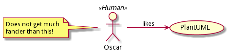

# plantuml-watcher

### Why
PlantUML is neat but comes with some pre-reqs on the environment with the install of GraphViz (and Java). Also the ideal workflow when desiging locally with PlantUML is a bit unclear. There IS a super nice Visual Studio Code plugin for it but it still comes with the environment pre-reqs AS well as the cumbersome pressing of Alt-D (or was it Ctrl-D??) to get the preview. For other IDE's I bet there are similar plugins leaving the same nasty taste of dissatisfaction...

This totally horrible situation has a quick remedy! (read on)

#### Usage
Initialize a file watcher from any folder.
```
$ docker run --rm -ti -v $PWD:/ws -w /ws oscarberg/plantuml-watcher
******************************************************************
plantuml-watcher watching for changes in .puml and .plantuml files
plantuml args: []
******************************************************************
watching: /ws/example.puml
```
It will wait for changes in plantuml files (.puml or .plantuml). Any change will trigger (re)draw of diagram to desired format.
```
change: /ws/example.puml
 > draw: /ws/example.puml
```


##### Advanced usage

Supports passing along additional flags to the plantuml jar. 

Useful ones like for example:  
**-tsvg** : Generate images using SVG format instead of the default PNG.  
**-progress** : Print the duration of complete diagrams processing.  
**-verbose** : Have log information.  
**-duration** : Print the duration of complete diagrams processing.  
**-h[help]** : Will give you the full list. Note that some of them wont work because off headless.  

And you can add:  
**--draw-on-add** to draw all watched on launch  
**--recursive** include subfolders

##### Advanced usage example
```
$ docker run --rm -ti -v $PWD:/ws -w /ws oscarberg/plantuml-watcher -duration -tsvg --draw-on-add
```

##### And why not go all the way and make an alias in your shell rc file?
```
#.zshrc
alias plantuml-watcher='docker run --rm -ti -v $PWD:/ws -w /ws oscarberg/plantuml-watcher'
```
Note the single quote. If you use double quote the substition will happen at the time of the alias declaration.

And now finally..
```
$ plantuml-watcher
******************************************************************
plantuml-watcher watching for changes in .puml and .plantuml files
plantuml args: []
******************************************************************
watching: /ws/example.puml
```
Ahh.. serenity